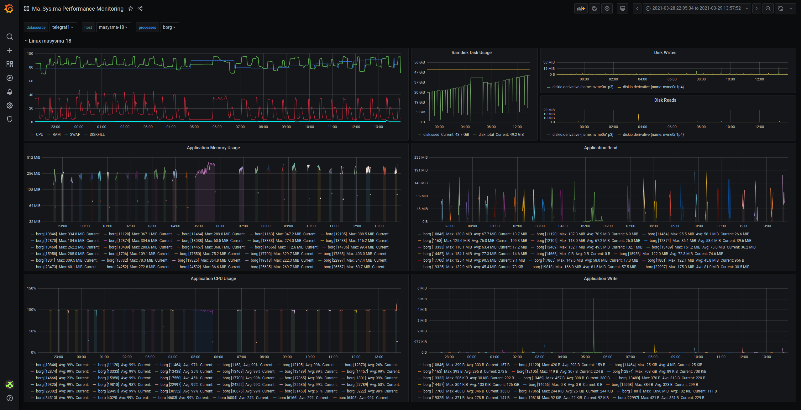

Preamble
========

Traditional backup tools can mostly be subdivided by the following
characteristics:

file-based vs. image-based
:   Image-based solutions make sure everything is backed up, but are potentially
    difficult to restore on other (less powerful) hardware. Additionally,
    creating images by using traditional tools like `dd` requires the disk that
    is being backed up to be unmounted (to avoid consistency issues). This makes
    image-based backups better suited for filesystems that allow doing
    advanced operations like snapshots or `zfs send`-style images that contain
    a consistent snapshot of the data of interest.
    For file-based tools there is also a distinction between tools that exactly
    replicate the source file structure in the backup target (e.g. `rsync` or
    `rdiff-backup`) and tools that use an archive format to store backup
    contents (`tar`).
networked vs. single-host
:   Networked solutions allow backing up multiple hosts and to some extent allow
    for centralized administration. Traditionally, a dedicated client is
    required to be installed on all machines to be backed up. Networked
    solutions can act pull-based (server gets backups from the clients) or
    push-based (client sends backup to server). Single-Host solutions consist of
    a single tool that is being invoked to backup data from the current host to
    a target storage. As this target storage can be a network target, the
    distinction between networked and single-host solutions is not exactly
    clear.
incremental vs. full
:   Traditionally, tools either do an actual 1:1 copy (full backup) or copy
    “just the differences“ which can mean anything from “copy all changed files”
    to “copy changes from within files”. Incremental schemes allow multiple
    backup states to be kept without needing much disk space. However,
    traditional tools require that another full backup be made in order to free
    space used by previous changes.

Modern tools mostly advance things on the _incremental vs. full_ front by
acting _incremental forever_ without the negative impacts that such a scheme
has when realized with traditional tools. Additionally, modern tools mostly
rely on their own/custom archival format. While this may seem like a step
back from tools that replicate the file structure, there are numerous potential
advantages to be taken from this:

Enclosing files in archives allows them and their metadata to be encrypted and
portable across file systems.

Given that many backups will eventually be stored to online storages like
Dropbox, Mega, Microsoft One Drive or Google Drive, the portability across file
systems is especially useful. Even when not storing backups online, portability
ensures that backup data can be copied by easy operations like `cp` without
damaging the contained metadata. Given that online stores are often not exactly
trustworthy, encryption is also required.

Abstract
========

This article attempts to compare three modern backup tools with respect to their
features and performance. The tools of interest are Borg, Bupstash and Kopia.
Additionally, the currently used Ma_Sys.ma Backup Tool JMBB is taken as a
reference. While it lacks a lot of the modern features with respect to the
other competitors, the idea to test the other ones stems from the intention to
replace JMBB with a more widely-used and feature-rich alternative.

Not in this Document
====================

Here are a few points that are explicitly not covered in this comparison:

 * Client-server backup solutions: While these tools are useful in certain
   contexts, they mostly expect there to be a central server to put backups
   to. As this does not model the reality of the Ma_Sys.ma backup process
   (which consists of multiple backup targets including offsite and offline
   ones), such tools are not considered here.
 * Restic.
 * Traditional backup tools: tar, rsync, rdiff-backup, bup, dar, ...
 * Non-free (as per DFSG) tools.
 * Considerations on the respective tools' crypto implementations.

Tools
=====

Here is a short tabular overview of the backup tools compared in this article
showing some (potentially interesting) metadata (as per 2021/03/17, data mostly
from the respective Github repository pages).

Name            JMBB      Borg         Bupstash  Kopia
--------------  --------  -----------  --------  -------
First Released  2013/08   2010/03 (1)  2020/08   2019/05
In Debian       No        Yes          No        No
Cloc (2)        6372      71757        13134     55124
Implemented In  Java      Python+C     Rust      Go
Version Tested  1.0.7     1.1.15       0.7.0     0.7.3

Tool      Type     Link
--------  -------  --------------------------------------------
JMBB      Website  <https://masysma.lima-city.de/32/jmbb.xhtml>
          Github   <https://github.com/m7a/lo-jmbb>
Borg      Website  <https://www.borgbackup.org/>
          Github   <https://github.com/borgbackup/borg>
Bupstash  Website  <https://bupstash.io/>
          Github   <https://github.com/andrewchambers/bupstash>
Kopia     Website  <https://kopia.io/>
          Github   <https://github.com/kopia/kopia>

### Footnotes

 1. First release of Attic which Borg is based on. Date according to Wikipedia
    <https://en.wikipedia.org/wiki/Attic_(backup_software)>
 2. Excluding non-source repository content. This is sometimes difficult, e.g.
    Kopia seems to consist of more than just the Go source code but it is hard
    to separate what is needed for documentation and what for the actual
    application. Take the numbers as estimates.

Features
========

As already mentioned in the Preamble, encryption and portability across file
systems are essential for modern backup tools. There are some other features
that are often already achieved by the traditional approaches which are
expected to be found in their modern competitors, too. Additionally, one could
envision some usful features that are rarely available.

The following table presents the Ma_Sys.ma's idea of a good set of features for
any modern backup program. A good program is expected to have all of the
_Basic Features_ and _Advanced Features_, while the _Very Advanced Features_
are seen as useful but less important.

Feature                                 JMBB  Borg  Bupstash  Kopia
--------------------------------------  ----  ----  --------  -----
Basic Features                                                 
shrink on input-file deletion           Yes   Yes   Yes       Yes
UNIX special files and metadata         Yes   Yes   Yes       No
read only changed files                 Yes   Yes   Yes       Yes
restore individual files                Yes   Yes   Yes       Yes
data encryption                         Yes   Yes   Yes       Yes
metadata encryption                     Yes   Yes   Yes       Yes?
portable across file systems            Yes   Yes   Yes       Yes
multithreading or parallelization       Yes   No    Yes       Yes
arbitrarily complex file names          No    Yes?  Yes?      Yes?
input file size irrelevant              No    Yes   (11)      Yes
input file number irrelevant            (4)   (4)   Yes       Yes
                                                               
Advanced Features                                              
compression                             Yes   Yes   Yes       Yes
integrity checks                        Yes   Yes   No        Yes
data archival                           Yes   (9)   (9)       No
works on slow target storage            Yes   (10)  (10)      Yes
readable by third-party tools           (2)   No    No        No
Windows support w/o WSL/Cygwin          (3)   No    No        Yes
retention policy for versions           No    Yes   Yes       Yes
deduplication                           No    Yes   Yes       Yes
directly upload to remote               No    (1)   (1)       Yes
                                                               
Very Advanced Features                                         
mount backup as r/o filesystem          No    Yes   No        Yes
multiple hosts backup to same target    No    Yes   Yes       Yes
process non-persistent live streams     No    Yes   Yes       Yes
configure output file size limit        No    Yes?  (12)      No
consistent state on interruption        No    Yes?  ?         ?
incremental metadata store/update       No    No?   Yes?      Yes?
concurrent write to same target         No    No?   Yes       Yes
retry on fail mechanisms                No    No?   No?       Yes?
GDPR-style data deletion requests       (5)   No?   No        No
integrated cloud storage client         No    No    No        Yes
data redundancy/bit rot recover         No    No    No        No
crypto-trojan-proof pull-scheme         No    No    (6)       No?
consistently backup running VMs or DBs  No    No    No?       (8)
REST API for submitting backup inputs   No    No    No        (7)
REST API for restoring                  No    No    No        (7)
REST API for monitoring                 No    No    No        (7)

Yes?/No? := guessed.

### Footnotes

  1. Yes, but only to tool-specific server.
  2. Yes, but practically limited to restoration of individual files.
  3. Yes, but only for restoring with a `cpio.exe`.
  4. Both tools' capability for many files is limited. Borg is limited by its
     sequential approach, JMBB is limited by loading its metadata completely
     into RAM.
  5. Yes, but: Requires obsoleting all related blocks manually by means of
     `jmbb -e` and `obsolete id`. Impractical for anything more than a few
     requests per year. Metadata is retained. Archival storage not affected
     (if used).
  6. Yes, but: Requires running Bupstash's server on the backup target machine.
     It is not acutally a pull scheme but a crypto-trojan-proof push scheme!
     See <https://bupstash.io/doc/guides/Remote%20Access%20Controls.html>
  7. APIs exist but their details have not been checked when this article was
     created.
  8. Can be implemented by custom Actions, see
     <https://kopia.io/docs/advanced/actions/>.
     Examples in the documentation do not indicate if this can be used in
     conjunction with reading backup input data from stdin. Hence it does not
     seem well-suited for large files like VMs.
  9. These tools can be configured to run in an append-only mode that allows
     users to establish a basic archival scheme. These features were not tested.
 10. Yes, but Borg failed to backup to a mounted WebDAV file system (during an
     explorative test). Bupstash consistently fails to backup to NFS but works
     fine on either SSH or SSHFS targets (see _Data-Test to NFS and SSHFS_).
     Hence, the problem with NFS is expected to be a bug rather then a general
     problem with slow target storages.
 11. Bupstash produces a large number of output files for large total backup
     input sizes. This may cause problem if limitations exist in the underlying
     storage/file system.
 12. Practically irrelevant as the output file sizes are always rather small.

## Rationale

The table is presented such that “Yes” means “good” and “No” means “bad”. Thus
there are negated lines like _input file size irrelevant_ because if the input
file size is limited/relevant that's bad and hence “No” is given in the table.

## Basic Features Explained

While many of the points under _Basic Features_ are pretty obvious, there are
some notable mentions:

UNIX special files and metadata
:   For regular user data, It is already important that a backup retains
    symlinks. I know at least one program that chokes on a missing socket
    file (although they should be ephemereal and YES, this was in the respecitve
    user's `/home` directory!). Additionally, when backing up system structures
    like chroots, whole root file systems, containers etc. it becomes important
    that devices and other UNIX special files are retained.

Metadata Encryption
:   Metadata is worth protecting. If you think otherwise, consider sending a
    list of all your files to your worst enemy/competitor. What might they
    learn? They will surely know what kind of software you are using already
    from the file extensions. They will know about the names of all installed
    programs if a system drive is backed up etc. Seeing when which of the files
    changed is even more interesting: They will know what projects you are
    working on and potentially even how well the effort is going...

Multithreading or Parallelization
:   Traditional backup tools (and even some of the more advanced ones) work
    sequentially. The advances of multiprocessing have been claimed for years.
    Yet many programs do not make use of that potential gain in performance.
    With respect to backup tools, the advantages of parallelization are
    sometimes downplayed by people claiming that a backup tool should not
    interfere with the computer's other activities and hence be as minimal as
    possible wrt. CPU/RAM resources. By this argumentation, a single-threaded
    backup would be sufficent. This does not model reality adequatly, though:
    Modern tools need not only backup highly loaded servers but also all kinds
    of client devices, too. Doing a user's backup in background may serve
    for some basic “data loss” prevention, but a proper backup should contain
    a consistent state of the data. A potential way to achieve this is to
    let the user do backups explicitly. Additionally, many people backup to
    external devices that should be taken offline “as soon as possible” to avoid
    damages by electrical failures. In both cases, _short backup times_ are
    desirable. While parallelization cannot be mistaken for high performance or
    short time of execution in general, it _scales_ and hence allows the backup
    to become faster with newer computers. It is always possible to turn
    parallelization off to have lower CPU load over a longer time, but being
    able to parallelize significant parts of the backup process saves time
    in practice and is thus desirable!

## Advanced Features Explained

Compression and Deduplication
:   Compression and Deduplication are both techniques to make the effective
    backup size on disk smaller. It is not exactly easy to clearly distinguish
    them (see <https://stackoverflow.com/questions/35390533/actual-difference-between-data-compression-and-data-deduplication> for an idea). Here is a shorter
    “rough” idea: Compression works on an individual data stream that cannot
    be added to/removed from later (except by rewriting it). Deduplication lifts
    this limitation by providing CRUD (create read update delete) operations
    while still eliminating redunancies.
    On the other hand, deduplication _does not imply_ compression because in
    practice, deduplication only works for “rather large” redundant pieces
    (many KiB) of data whereas typical compression algorithms already work in
    for sub-KiB input data sizes. Good tools hence combine both approaches.
    Deduplication is a very useful feature for a backup tool because it allows
    backing up certain data that are largely redundant (like virtual machines
    and containers) to target storages that are much smaller. While it
    is often claimed that “storage is cheap”, this claim fails as soon as the
    limits of a single drive are reached. Even which cheap storage, needing less
    of it allows a higher number of old backups to be retained at same cost.

~~~
# an example of compression working efficiently for less than 1 KiB
# of redundant input data:
$ for i in `seq 1 80`; do echo hello world; done | wc -c
960
$ for i in `seq 1 80`; do echo hello world; done | gzip -9 | wc -c
41
~~~

Integrity Checks
:   In an ideal world, everyone would test their backups regularly by performing
    a full restore. Given certain storage and time constraints and difficulty
    in automating such a process -- remember that such a process works on actual
    production data and needs to access them all -- the ability to check the
    restoration without actually providing the comparison data is an important
    feature.

Data Archival
:   Often not seen at the core of a backup strategy, _data archival_ is the
    process of collecting old data and storing it _away_ i.e. separate from
    the “active” production data and backups. Accessing an archive is the last
    resort for certain tasks like “our database has been corrupted for months
    and nobody noticed”. While one might argue that such a thing _never_ occurs,
    here is a counterexample from experience: In the Thunderbird E-Mail client,
    I used to have a default setting that if a folder contained more than 1000
    messages, the oldest ones would be deleted until there were only 1000 left.
    This seemed reasonable at the time of setup but backfired when a local
    folder of collected mailing list wisdom exceeded the limit. Of course, as
    that folder was accessed very rarely, it took literally months to notice.
    By then, a certain number of messages had already vanished. Had there only
    been a “regular” backup, luck would have been needed to have it configured
    to retain yearly snapshots or such. Using archive data, it was not exactly
    easy to retrieve the lost messages (given that two MBOX files had to be
    merged), but it was possible and performed successfully.
    Now why is the archive stored away? The main reasons are: (1) Archives are
    much larger than the regular backups because they contain all of the data.
    Hence, it makes sense to keep them on cheaper and slower storage. The
    traditional way would be using tape, but a dedicated (low-end) NAS or an
    extra large pair of HDDs may also serve. (2) Archives should be protected
    from the typical accidents like deletion, malware etc. Just like with
    backups it makes sense to keep copies of them offsite, but (also just like
    with backups) this means additional costs. In certain cases where archives
    are rarely needed, it might make sense to not have multiple copies of
    them. It is interesting to note that data archival does not seem to be a
    feature really addressed by most modern backup tools.

Works on Slow Target Storage
:   Even tools that do not support storing their data to network devices may be
    used in conjunction with networked file systems like e.g. NFS, SSHFS,
    WebDav etc. Except for NFS, these file systems' characteristics differ
    so much from local ones that it is not uncommon for tools to choke on them.
    E.g.: I once tried to create a 7z archive directly on an SSHFS and it was
    extremly slow. Much slower than first creating the 7z locally and then
    sending it to the remote with `scp`. While slowless can and needs to be
    accepted in this context _to some extent_, there are limits. Also, some
    tools actually fail to store their backups on slow targed storages.
    Everything from stack traces, timeout errors and totally unclear messages
    has been observed in practice including cases where restoring the backup
    was not possible afterwards.
    It thus makes sense to explicitly research on this, although it is difficult
    to make a definitive decision on it in practice.

Readable by Third-Party Tools
:   A backup needs to be restorable in time of need. While the best choice of
    restoration is certainly the tool the backup was created with, it is also
    imaginable that the program will not be available on the target of
    restoration. Also, imagine that the restoration routine does not work at
    all or fails due to an inconsistency in the backup or some other error.
    A means to establish confidence in the reliability of the solution is the
    ability to restore data even without the tool that originally wrote them.
    Given the complexity of storage that includes deduplication, encryption,
    compression and multiple backup versions/hosts it is not surprising that
    most modern tools' data can only be read by themselves. Yet, it would be
    highly desirable for independent and compatible restoration tools to exist!

Windows Support w/o WSL/Cygwin
:   Even if Linux is the primary system of concern (for the sake of this
    article), there are good reasons for why Windows support is beneficial:
    Restoration in time of need could happen on a common device found somewhere
    including lent or old devices. Chances are, these will run some
    (potentially ancient!) sort of Windows. Restoration on Windows would be
    the only chance in this scenario. WSL, Cygwin, Docker, VMs and all other
    imaginable „Linux on Windows” means _do work in practice_, but only under
    certain good circumstances like: reasonably powerful computer,
    administrative privileges, permission to modify OS data, Internet access.
    From an entirely different point of view: Linux-only networks are pretty
    rare. Most often, there are some Linux servers and Windows clients. Given
    that a good backup tool is already known on Linux, why not use the tool
    for Windows, too? Hence, while not strictly essential, the ability to also
    _create backups on Windows_ has its advantages!

Retention Policy for Versions
:   A _retention policy_ specifies how many old backup states are to be kept.
    Traditional solutions often impose limits on this by the technical aspects
    of incremental and full backups e.g.: All increments from the latest full
    backup up to now inclusive need to be retained to restore the latest state.
    Modern tools no longer have this restriction and can thus provide more
    useful retention policies like e.g.: Keep the last three versions plus one
    copy from each of the last three weeks. This would be six backup states in
    total reaching back three weeks from now with reduced “density” for the
    older versions. Retention policies are desirable, because they can serve
    as a (limited) substitute for archival storage. Additionally, restoring
    from a retained backup state is expected to always be faster/cheaper/...
    than from archival storage.

Directly Upload to Remote
:   As already mentioned in the Preamble, backups are nowdays often stored on
    online storage. Of course, a local server may also do, but
    local filesystems as target storage are certainly the exception. It thus
    makes sense for backup tools to integrate the ability to upload the backup
    data directly to a target server. In the case of having a dedicated server
    component for the respecitive backup tool, this can enable additional
    features up to the complexity and power of networked backup solutions.

## Ideas for Very Advanced Features

Mount Backup as R/O Filesystem
:   Mounting backups is useful because it allows chosing the files to restore
    using the established file mangers designed for the purpose of navigating
    large directory structures. It is not strictly needed but user-friendly.

Multiple Hosts Backup to same Target
:   This is a feature from networked backup solutions that could be achieved by
    single-host tools, too. It is especially intersting to consider tools
    deduplicating across multiple hosts as this makes OS backups very efficent.
    There are some limits on this e.g. multiple hosts writing to the same target
    storage concurrently or one of the hosts corrupting the data of other hosts
    by incorrectly/maliciously performing deduplication actions.

Process Non-Persistent Live Streams
:   While this article concentrates on file backups, there are also things like
    databases that can be backed up by “exporting” them to a file/stream. Some
    backup tools can process these streams directly avoiding writing sensitive
    and large data to a temporary storage.

Configure Output File Size Limit
:   Cheap online storages often impose a maximum file size limit. While it is
    often pretty large (e.g. magnitude of GiB) for paying customers, it is often
    tightly limited for “free” accounts (e.g. magnitude of a few MiB). If a
    tool can adjust to these limits, it becomes usable across a wider area of
    target storages.

Consistent State on Interruption
:   Backup processes might get interrupted. Just like other important processing
    tasks, it should be possible to resume them and recover from crashes. Some
    tools (e.g. JMBB) do not support this, though.

Incremental Metadata Store/Update
:   While the actual data contents are often compressed/deduplicated and stored
    efficiently minimizing the number of read and write operations, same does
    not necessarily hold for the metadata. JMBB just rewrites the whole
    “database” of metadata on each run. Advanced tools often seem to use local
    cache directories to speed up the management of metadata. Neither solution
    is ideal: The ideal tool would not need such things and rather store
    everything efficiently.

Concurrent Write to Same Target
:   While it seems difficult to support this for non-networked solutions,
    there are multiple tools claiming to do this. The advantage is clearly that
    one could configure a lot of machines independently to store to the same
    target and one would not need to coordinate the times at which backups are
    performed. One could even have multiple users run backup processes to the
    same target at the time of their own choice.

Retry on Fail Mechanisms
:   Especially in the presence of slow storage or virtual hard drives backed
    by networks, it makes sense to retry failed write operations. Similarly,
    the input file system may change while being backed up and a retry could
    find another (consistent) state. Tools do not usually implement this,
    possibly due to high complexity and difficulty in deciding _when_ to retry.

GDPR-style Data Deletion Requests
:   While it can be argued that data need not be explicitly deleted from
    backups due to the excessive complexity of implementing it securely, it
    would nevertheless be interesting to find out what means a backup program
    can provide to actually delete data from the backups in the sense that the
    program assures that after completion of the process, data is no longer
    present in the backup. This differs from operations that try to re-claim
    space occupied by deleted data in that these can work on a best-effort basis
    without issues whereas regulatory deletions need to actually happen.

Integrated Cloud Storage Client
:   This is the advanced version of _directly upload to remote_ where backups
    not only go to a remote location but explicitly an Internet target. Tools
    supporting this are expected to be able to directly communicate with
    the respective vendor-specific APIs.

Data Redundancy and Bit Rot Recover
:   The larger the data to be backed up becomes, the more likely _bit rot_ is
    to occur. Many authors of backup tools argue that it is better to avoid bit
    rot at a different level in the storage hierarchy, e.g. file systems like
    ZFS could ensure this. This does not, however, match the practical
    requirements of being able to portably use backups across file systems.
    Strong restrictions are imposed by portable devices: E.g. ZFS is a poor
    choice given that it can only be read on specialized systems and needs to be
    imported/exported all the time. Other Linux file systems are more portable
    across Linux versions but cannot be read on Windows. If compatibility is
    sought, only exFAT, FAT32 and the like remain -- all choices that offer
    _no_ protection for the stored data. Hence, integrated redundancy is
    useful. Tools do not usually seem to implement this, though.

Crypto-Tojan-Proof Pull-Scheme
:   In recent times, ransomware malware attacks have risen. All backup tools
    need to be audited as to how malware could destroy old copies of the data
    it encrypts. In fact, many known attacks by ransomware specifically included
    a dedicated strategy by the adversary to delete backups. It has often been
    concluded from that, that only a pull-based scheme is a safe scheme. It
    turns out that reasonable ideas for making a safe push-based scheme (e.g.
    simplified: with a server that does not allow deletion) also exist. All of
    the measures to protect against ransomware are subsumed under this point.

Consistently Backup running VMs or DBs
:   In an ideal world, there would not be a need to export/stream certain
    hard-to-backup data to the backup tool. Instead, the tool would detect
    the presence of such data and automatically invoke the necessary backup
    procedure. Typical file-based tools do not implement anything like that,
    though.

REST APIs
:   Modern programs often interact with REST APIs. Having them available, allows
    for a high grade of automation and monitoring and thus enhances the
    reliability and completeness of a backup. It is not a required feature,
    though.

Benchmark Scenario
==================

The benchmark scenario presented in this article is intended to closely resemble
practice with some simplifications to allow performing tests in reasonable time.

These simplifications include running backups directly after each other,
reducing the amount of input data and preferring the use of faster storages to
distinguish the backup tools' performances from the underlying storage systems'.

The benchmark consists of multiple groups of tests described in the following
subsections.

## Data-Test

The _Data-Test_ most closely resembles the typical backup operation. This test
consists of multiple past states of the most important Ma_Sys.ma data. These
states were recovered from an archive created with JMBB.

Here is a table showing the 30 snapshots used for the tests:

State  Represents Date  Size/GiB  Number of Files
-----  ---------------  --------  ---------------
x2a00  15.06.2018       26.73     387026
x2a4c  07.07.2018       27.22     391406
x2aaf  27.07.2018       27.95     393288
x2af8  29.08.2018       27.94     398013
x2b81  18.09.2018       28.28     417315
x2bcb  14.10.2018       28.19     407058
x2c15  13.11.2018       28.80     411347
x2c80  18.12.2018       29.00     415495
x2ccb  18.01.2019       29.72     422693
x2d17  18.02.2019       30.04     429587
x2d6b  14.03.2019       30.48     429836
x2dbf  14.04.2019       30.94     453757
x2e0c  14.05.2019       31.40     456110
x2e57  09.06.2019       31.84     461060
x2eb4  18.07.2019       33.26     466967
x2efd  17.08.2019       33.68     470190
x3001  26.12.2019       40.59     525879
x30da  24.02.2020       35.93     473647
x312a  24.03.2020       34.84     461554
x31a3  21.04.2020       35.36     466773
x31ec  27.05.2020       36.03     471625
x323b  22.06.2020       37.14     476479
x3288  23.07.2020       37.78     479961
x32e1  23.08.2020       38.51     483756
x3333  20.09.2020       38.97     487709
x338a  03.10.2020       40.06     490852
x33d5  28.10.2020       40.51     494283
x3436  22.11.2020       41.50     484262
x3483  18.12.2020       42.42     487438
x34d7  20.01.2021       42.45     489874

Here are two graphs displaying how the data might have changed between these
versions. A file with change in modification date is considered _changed_,
a file not present in the previous backup is considered _added_ and a file
not present in the current backup is considered _removed_. Of course, in
practice, it's the backup tools' job to identify the changes and they all do
this surprisingly well.

The basic test procedure is as follows:

 * For each backup tool initialize an empty backup target repository
 * For each backup state:
    * Load backup into ramdisk
    * For each backup tool:
       * backup from ramdisk to target repository.
       * expire all but the most recent backup.
       * invoke GC procedure.
    * Analyze the state of the output directories
 * For each backup tool restore most recent state to ramdisk and compute
   all files' SHA-256 hashes.

The Data-Test is executed for different backup target storage types:

 1. Backup to local NVMe SSD
 2. Backup to remote SATA SSD over NFS (without testing restore)
 3. Backup to remote SATA SSD over SSHFS (without testing restore)

## Games-Test

The _Games-Test_ scenario uses a larger input set of playonlinux game
installations.

Testset  Size/GiB  Number of Files  Largest File/GiB
-------  --------  ---------------  ----------------
Games    172.33    123 345          3.99

The test procedure is as follows:

 * For each backup tool except JMBB:
    * Backup games directory from HDD to remote SATA SSD.
    * Backup games directory again to remote SATA SSD.
    * expire all but the most recent backup
    * invoke GC procedure

The idea of this test is as follows:

 * The first run finds out how well the tool copes with many small files on
   HDD. Traditionally, all tools have issues with this...
 * The second run checks how efficiently the tools cope with unchanged files.

To transfer data over network, the following protocols are used:

 * Borg: NFS, because it is known to work quite well from previous experience
 * Bupstash: SSH with Bupstash on target server
 * Kopia: SSH without Kopia on target server

Like with the Data-Test, caches reside on a local NVMe SSD.

## VM-Test

The _VM-Test_ simulates backing up virtual machines and is intended to check the
tools' performance wrt. in-file deduplication potential. It consists of two
partially overlapping test data sets.

Test Data Set  Size/GiB  Number of Files  Largest File/GiB
-------------  --------  ---------------  ----------------
VMS0           414.70    9                88.31
VMS1           459.28    9                88.31

Here is a table of the input files. Names have been simplified, sizes are
displayed as reported by DirStat 2's GUI.

File                       Changed  Size0/GiB  Size1/GiB
-------------------------  -------  ---------  ---------
`list.txt`                 yes      0          0
`app-docker-backup.qcow2`  no       70.1       70.1
`deb-64-new.qcow2`         yes      80.9       80.9
`deb-mdvl-64....qcow2`     yes      38.62      --
`deb-sid.qcow2`            yes      49.21      49.36
`test-ubuntu.qcow2`        yes      --         22.16
`win-10-64-de....qcow2`    yes      --         84.8
`win-10-64-ds.qcow2`       no       88.31      88.31
`win-8-1-32-ds-o.qcow2`    yes      23.21      --
`win-8-1-32-ds.qcow2`      yes      52.12      52.12
`win-xp-sp-3-ht-1.qcow2`   no       13.11      13.11
                                                
                           Sum      414.70     459.28

The test procedure is as follows:

 * For each backup tool except JMBB:
    * Backup VMS0 from SATA HDD to remote SATA SSD
    * Backup VMS1 from SATA HDD to remote SATA SSD
    * expire all but the most recent backup
    * invoke GC procedure

Kopia and Borg were run over NFS, Bupstash over SSH, because it failed to
execute the GC procedure over NFS.

## Auxiliary Tools

In order to capture information about the respective tools' runtimes, the
system loads and the states of files on disk, the following tools have been
used in conjunction:

 * commandline tools `du`, `ls -R`, `find`,
   [parallel(1)](https://manpages.debian.org/buster/parallel/parallel.1.en.html),
   [sha256sum(1)](https://manpages.debian.org/buster/coreutils/sha256sum.1.en.html)
 * GNU Time ([time(1)](https://manpages.debian.org/buster/time/time.1.en.html),
   not the shell builtin)
 * [dirstat(32)](../32/dirstat.xhtml) with PostgreSQL.
 * Libreoffice Calc to mangle tabular results and create diagrams from SQL
   queries against the DirStat 2 database.
 * Telegraf, Grafana, Influxdb

Scripts used to run the respective tests can be found in directory `automation`
inside the repository associated with this article.

## Test Platforms

Three computers participate in the tests, all running Debian 10 Buster amd64.
The tests themselves were executed in a systemd-nspawn container on
`masysma-18` running Debian 11 Bullseye (Testing):

Host          Use                   RAM/GiB  ECC  CPU                   FS
------------  --------------------  -------  ---  --------------------  ----
`masysma-18`  Main test machine     128      Y    Intel Xeon W-2295     ZFS
`pte5`        NFS and SSHFS target  32       Y    Intel Xeon E3-1231v3  ext4
`masysma-16`  Influxdb, Grafana     8        N    Intel Celeron J3455   ext4

In terms of network, all machines are connected through a Gigabit Ethernet
switch. Additionally, a 10GE link between `pte5` and `masysma-18` is established
for data transfers (NFS, SSHFS, SSH).

Pre-Test Insights
=================

Before beginning the actual tests, some experiments were made to determine the
usage of the respective tools. Additionally, previous experience with JMBB and
Borg already existed. This section provides a summary of related insights and
findings.

Borg works purely sequential. There is a long standing issue in Github
<https://github.com/borgbackup/borg/issues/37> about this and it boils down to
the fact that it is difficult to add multithreading in retrospect. From regular
use at the Ma_Sys.ma, Borg is known to backup successfully over SSH to its own
server, NFS (without dedicated Borg server on the receiving end) and external
HDD storage.

JMBB is highly resource-intensive. Upon development, compression was the major
idea to reduce output data size and the huge amount of memory was not seen as
a problem due to the presence of ever growing RAM sizes in the computers. So far
this held true, but test results (see further down) confirm that JMBB's use of
CPU and memory is quite wasteful.

Bupstash is the newest contender and has some rough edges. Upon getting started
with the tool, a _Permission denied_ error was encountered when trying to backup
some data. In fact, the user account lacked permissions to read some of the
files, but: Bupstash would not tell which of the files the error was about and
it would also not continue the backup process. It was intended to report this
as a bug, but as of 2021/04/09 the issue is already fixed in the latest git
version -- it now reports which file/directory caused the error.

Setting up Bupstash is straight-forward due to a limited and sensible set of
options. It is more complex than with JMBB or Borg though, because it requires a
dedicated key to be generated and that key is not backed up by default. This
essentially means that it is the user's responsibility to protect the key with a
password and store the result with the backup in order to be able to later
restore the backup by using a password.

Kopia is the hardest tool to setup from all the tools considered here. This
starts with initializing a backup storage: All tools except JMBB need this step
before performing the first backup whereas JMBB asks the user interactively for
the password upon first backup but otherwise does not need to do any setup.
Kopia, however, requires three setup steps:

 1. Creation of a “repository”
 2. Connecting to the repository
 3. Configuration of a backup policy

The second step may stem from the fact that Kopia supports multiple different
target storages that may require a dedicated and specific login procedure of
sorts. The _backup policy_ thing is quite unintuitive though: Kopia has
“global” and target-specific policies where things not configured in the
target-specific one can be inherited from the “global” ones. Also, the default
policy includes that files listed in `.kopiaignore` files are ignored opening
up a simple attack surface where a malware would just add all of the user's
files to hidden `.kopiaignore` files tricking the user into believing that data
is backed up while it is in fact ignored. To some extent, this is my point of
view that backup excludes should be minimal as not to confuse the user about
which files are backed up and which not. Of course, `.kopiaignore` is also a
useful feature to allow ignoring certain files that do not need to be backed up
with exceptionally fine granularity.

Test Results
============

## Data-Test

Here is a table of the sizes of the backup target and cache directories after
backing up the respective given state. States in between have been tested, too,
but are not shown in the table.

State  Tool      Files in Cache  Size of Cache/MiB  Backup Files  Backup/MiB
-----  --------  --------------  -----------------  ------------  ----------
x2a00  Borg      8               50                 63            18 022
       Bupstash  3               13                 41 833        20 897
       JMBB      --              --                 877           18 283
       Kopia     51              197                2 629         24 948
       Kopia*    54              197                2 635         24 901
                                                                   
x2eb4  Borg      8               66                 134           23 048
       Bupstash  3               26                 49 863        26 298
       JMBB      --              --                 1 221         24 172
       Kopia     777             790                3 631         34 214
       Kopia*    7 223           1 367              3 736         31 926
                                                                   
x34d7  Borg      8               90                 228           30 908
       Bupstash  3               30                 63 056        33 978
       JMBB      --              --                 1 717         34 357
       Kopia     2 279           1 883              5 591         53 535
       Kopia*    26 086          3 349              5 513         43 076

The following conclusions can be drawn from the output sizes for the respective
tools:

 * Borg: Borg produces the smallest overall backup sizes and the smallest
   number of files. These individual files are large, though (the largest file
   in the backup is 502 MiB large)
 * Bupstash: Performs quite OK, but produces the largest number of output files
   which is more than factor ten to the nearest contender. It is also worth
   noting that almost all of these files are concentrated in a single directory
   which could cause problems with some file systems and thus limits the
   result data structure's portability.
 * JMBB: Works without cache directories and shows fragmentation effects:
   While initial backups contain only relevant files and are almost as small
   as Borg's, in the end, JMBB produces the second largest overall backup size.
   Fragmentation is a known problem in JMBB and in practice, backups have
   grown beyond the input data size due to it.
 * Kopia: On first sight, Kopia does not perform well _at all_: It produces
   the largest backup output size already at state x2eb4 and uses _a lot_ of
   cache space only to worsen for state x34d7. The culprit seems to be a
   mechanism in Kopia that makes maintenance tasks (which are required to
   free up space!) run only after a certain _wall clock time_ has passed. As the
   backups were created in an automated fashion in less than 24h of runtime,
   Kopia's maintenance routine _never ran_, i.e. the ultimate state seen
   actaully contains snapshots of all the individual backup states without
   anything freed. As of this writing, there does not even seem to be a flag
   to force the maintenance.
   See <https://kopia.discourse.group/t/how-to-immediately-gc-unused-blobs/295>
   and <https://github.com/kopia/kopia/issues/800>.
 * Kopia*: In order to actually run Kopia's garbage collection procedure, a
   separate VM was prepared with the test data and its clock was set to the
   respective original backup dates before invoking Kopia. Logs and file sizes
   confirm that the cleanup procedure actually ran. It is worth noting that this
   invocation caused even larger cache directories to be generated. Upon
   inspecting the cache's file structure, there is no obvious indicator as to
   _why_ it is that large.

Concluding from the backup size performance, Borg seems to perform best, JMBB
seems very viable and Bupstash does a good job apart from the large number of
files. Kopia tests are more difficult to perform due to its invocation behaving
time-dependently. Even with a “faked” system time, Kopia's backup size remains
larger than the other tools' and its use of cache data seems excessive
especially with respect to the other tools'.

Another aspect to check for the tools is how much computation power and time
they needed.

Columns _Wall Time_, _Peak Memory_ and _Avg. CPU_ are populated by the data from
GNU Time as reported for the script that does the actual backup run followed
by a garbage collection. In theory, I/O statistics were also gathered by
_Telegraf_, it turned out that the data was quite unrealistic due to various
effects including the long sample time (15sec) and the exclusion of child
processes. Hence, I/O is not shown here.

For CPU: 100% means one core fully loaded, i.e. 2000% means „20 cores fully
loaded”. The test system's Xeon W-2295 exposes 36 virtual cores to the OS.
Hence 3600% CPU load means „all cores fully loaded”. Due to Amdahl's Law, it
is unlikely/impossible to attain 3600% CPU for realistic workloads like those
presented here.

State  Tool      Wall Time/s  Peak Memory/MiB  Avg. CPU/%
-----  --------  -----------  ---------------  ----------
x2a00  Borg      9 579        388.59           99
       Bupstash  120          54.75            115
       JMBB      1 297        24 912.91        2 862
       Kopia     168          1 403.60         340
       Kopia*    147          883.64           291
                                                
x2eb4  Borg      624          349.76           99
       Bupstash  88           45.65            101
       JMBB      117          18 481.07        2 276
       Kopia     72           955.36           400
       Kopia*    49           600.93           226
                                                
x34d7  Borg      359          399.51           99
       Bupstash  106          51.02            100
       JMBB      80           24 115.33        1 645
       Kopia     91           757.91           415
       Kopia*    56           558.57           224

Before drawing any conclusions, here are some notes about the data in general:

 * The values for all entries except “Kopia*” have been found to be similar to
   those collected by _Telegraf_.
 * The data for Kopia* cannot be compared to the other ones because the VM has
   a different target file system (ext4 rather than ZFS) and less CPU threads
   (18 instead of 36).

The following conclusions can be drawn about the individual metrics from thte
table above:

 * In terms of time, one can observe three tiers: (1) Borg is the slowest with
   factor 80 to the fastest contender for the initial backup and factor 3
   compared to the next slowest alternative in the last backup. (2) JMBB is much
   slower than its newer and more feature-rich alternatives Kopia and Bupstash
   and ranges from factor 11 (worst case initial backup cration) to being
   the fastest among the contenders for the last backup. It is quite notable
   that in terms of speed, it can still compete with the new and shiny. (3)
   Bupstash and Kopia expose similar timings and perform initial backups at
   astonishing speeds. While their times differ seemingly significantly, it has
   to be taken into account that backing up from RAM to NVMe SSD is an absolute
   ideal scenario where I/O times are almost zero. Hence, one cannot conclude
   that in practice, the one will be faster than the other. Judging from the
   not-directly-comparable ext4 results for the Kopia* VM one can see that
   at least in this test, Kopia does not show any sign that it is slowed down
   by the actual activation of garbage collection routines. One might even
   speculate that they speed up subsequent backups?
 * In terms of memory, the situation is quite obvious. From best (most
   memory-efficient) to worst (most memory-wasteful) one can arrange them as
   follows: Bupstash, Borg, Kopia, JMBB with JMBB being worlds less efficient
   than the others. In the worst case (last backup) it peaks at 473 times the
   memory of the most efficient contender Bupstash. The only thing to note in
   JMBB's defence is that of course, having less cores available will make it
   use less memory as fewer parallel XZ compressors will run. Still, it is clear
   that JMBB requires the most memory by a large margin. As a side-note,
   JMBB's README recommends 300 MiB + 36 * 600 MiB = 21900 MiB of RAM showing
   that even my past estimate does not put up with what it really needs.
   Apart from the extreme JMBB, a typical modern computer should not have any
   issues with running any of the programs. It is interesting to note that
   the best contender in terms of memory (Bupstash) undercuts its nearest
   alternative Borg by factor 7 and operates fine with a maximum of 55 MiB
   making this tool suited for invocation on low-end devices like ARM SBCs or
   i386-machines which may have as little as 512 MiB RAM provided that one
   can compile it for the respective platforms (not tested here!).
 * Looking at the CPU usage, Kopia and JMBB are the tools that obviously run
   significant parts of their computation in parallel. JMBB is again the
   heaviest on resources while the other tools load the CPU much less such that
   other applications may continue to function with minimal performance issues.
   Borg acts purely single-threaded yielding an average CPU usage of 99%.

## Data-Test to NFS and SSHFS

To find out how times change with a more realistic scenario where data is sent
over network, tests with NFS and SSHFS targets have been performed. The
following wall times could be observed for the different target storages.
Column _Local_ has been copied from before for comparison.

State  Tool      Local/s  NFS/s  NFS3/s  SSHFS/s
-----  --------  -------  -----  ------  -------
x2a00  Borg      9 579    8 954  7 913   11 256
       Bupstash  120      1 243  1 157   470
       JMBB      1 297    690    696     8 392
       Kopia     168      271    277     350
                                          
x2eb4  Borg      624      596    746     655
       Bupstash  88       --     116     108
       JMBB      117      106    69      492
       Kopia     72       76     83      117
                                          
x34d7  Borg      359      367    383     371
       Bupstash  106      --     122     113
       JMBB      80       59     62      391
       Kopia     91       96     107     151

From past experience with the respective storage targets, one would have
expected to find the following sequence (shortest to longest time):
Local, NFS, SSHFS. It turns out that in practice, for the backup tools, results
vary geratly.

The results for Bupstash over NFS are missing from the second test onwards due
to the fact that a reproducible error occurs when invoking the garbage
collection procedure over NFS:

	b77083cf8d227db12e904da3a175e2c3
	1 item(s) removed
	bupstash serve: Bad file descriptor (os error 9)
	bupstash gc: remote disconnected
	Command exited with non-zero status 1
	56.05user 14.75system 1:11.13elapsed 99%CPU (0avgtext+0avgdata 51240maxresident)k
	59731063inputs+865458outputs (180major+65251minor)pagefaults 0swaps

As part of creating this article, this issue has been reported under
<https://github.com/andrewchambers/bupstash/issues/157>. Update 2021/04/11:
NFS tests were repeated with mount options `nfsvers=3,nolock` to measure
Bupstash's performance over NFS -- the new results are provided in column
_NFS3_.

Apart from that, certain combinations of tool and storage seem to be
problematic:

 * Bupstash takes ten times the execution time for the initial run on NFS.
   Its access pattern seems to somehow fail for NFS whereas it runs quite
   acceptably over SSHFS. Using the options for working around the locking
   issue one can observe that the slowdown for operating Bupstash on NFS is
   much smaller (about factor 1.3) for the subsequent runs.
 * JMBB takes four to six times the execution time when running on SSHFS.
   One explanation might be that JMBB compresses all data it reads and writes
   from and to the target storage and hence sshfs' default compression will
   decrease performance significantly. See
   <https://www.admin-magazine.com/HPC/Articles/Sharing-Data-with-SSHFS> and
   <https://superuser.com/questions/344255/faster-way-to-mount-a-remote-file-system-than-sshfs>
   for some ideas about how performance could be improved. They were not tested.
 * Borg runs somewhat slow on SSHFS for the initial backup.

Kopia exposes the performance characteristics that one would have expected from
experience before this test i.e. runs on NFS are slightly slower than local FS
and runs on SSHFS are even slower.

It is quite interesting to note that under certain circumstances, tools run
_faster_ on NFS compared to the local file system. This is most likely related
to (a) the difference in file systems (ZFS local vs. ext4 remote) and (b) the
ability to use the processing power and RAM cache from `pte5` in addition to the
local resources on `masysma-18`. SSDs on `pte5` are known to be slower than
those on `masysma-18` hence the difference cannot be explained by the underlying
storages' capabilities alone.

To conclude from the NFS and SSHFS tests it seems that apart from certain bad
interactions, all tools are suited for invocation on remote file systems.

## Checking the Diagrams: Grafana Dashboards during the SSHFS-Test

In addition to GNU Time, tests were monitored by Telegraf, Influxdb and Grafana.
Although the results proved not to be all that useful in terms of precision,
they enabled getting an explorative “feeling” of the data.

The first screenshot is most notable for the _Ramdisk Disk Usage_ where one can
observe each of the data sets being filled in and staying constant during the
processing. The upper left graph displays CPU, RAM, SWAP and DISK usages. The
spikes in memory and CPU usage come from JMBB executions :). Below these
diagrams, one can find the individual process' metrics which are not really
useful on such a long time scale.

Although they are still largely indecipherable, one can already observe the
longer execution time for Borg form this perspective. `java` processes are not
plotted here because given that there were some other Java background tasks,
they would clutter the view by overlaying the other tools' graphs.

Drilling further down reveals the use and imprecision of the
application-specific diagrams. The first row of diagrams is now mostly constant
whereas the second and third one show memory, I/O and CPU respectively. From
the “stairs” one can already conclude that the sampling time is far longer than
would have been needed to achieve precise values for I/O, hence the area under
the I/O graphs does not sum up to the actually performed I/O.

## Data-Test Restoration

All tools restored all file contents correctly from the backup according to the
files' SHA-256 checksums.

Here is a table of the tools' restore performance characteristics. In addition
to the measures from GNU Time, a _Speed_ value has been derived from the data
size (around 44 008 MiB) and the wall time.

Tool      Wall Time/s  Speed/(MiB/s)  Peak Memory/MiB  Avg. CPU/%
--------  -----------  -------------  ---------------  ----------
Borg      1 333        33             148.80           98
Bupstash  306          144            72.34            132
JMBB      2 806        16             16 583.30        119
Kopia     230          185            1 253.41         582

This time, the tools' performance can be clearly ordered from best to worst as
follows: Kopia, Bupstash, Borg, JMBB.

This test drastically puts apart the old and the new backup tools: Bupstash and
Kopia outperform their competitors by at least factor four and JMBB's restores
are twelve times slower compared to Kopia's while at the same time needing
thirteen times as much memory.

One can also observe that Kopia is the only tool to perform significant parts of
the restore in parallel yielding the best overall performance. Bupstash and Borg
run very efficiently wrt. memory consumption. It is good to know that while Borg
needs more than 300 MiB for backup creation it can restore with half of the
memory. Also, Borg is significantly faster in restoring than in creating the
initial backup although it has about 1.6 times the data to handle accounting for
the increase in backup size from the initial backup x2a00 to the last backup
x34d7.

## Games-Test

Here are the test results for the _Games-Test_.
The following table shows the backup sizes after the respective tools' first
runs. This data does not change significantly for the subsequent run:

Tool      Files in Cache  Size of Cache/MiB  Backup Files  Backup/MiB
--------  --------------  -----------------  ------------  ----------
Borg      8               24                 322           115 113
Bupstash  3               21                 138 288       130 550
Kopia     50              66                 14 371        154 748

Here are the tools' performance results from GNU Time: T1 is the initial run
and T2 the same run again i.e. with unchanged input data.

State  Tool      Wall Time/s  Peak Memory/MiB  Avg. CPU/%
-----  --------  -----------  ---------------  ----------
T1     Borg      34 899       312.86           98
       Bupstash  2 760        56.78            66
       Kopia     1 369        2 715.75         277
                                                
T2     Borg      18           166.03           86
       Bupstash  3            31.16            36
       Kopia     10           160.90           263

The resulting backup sizes are similar to those for the data tests although this
time, differences between them are larger and Kopia's larger backup size cannot
be attributed to missing garbage collection. On the positive side, caches seem
to be smaller than with the Data test. This hints towards a certain growth in
cache over time (i.e. after n > 1 backups caches are larger than after one
backup).

Kopia takes 38.7 GiB more storage space compared to Borg making the difference
quite significant. Again, a huge difference in the number of files can be noted
between the tools where Bupstash's 138 288 files (almost all) in a single
directory can be foreseen to cause trouble when e. g. attempting to copy the
files to another location or upload them to a remote storage.

Comparing the backup times has to take into account that the tools use different
protocols to transfer their data over network. Borg and Kopia both run without
their counterparts on the server (Borg over NFS, Kopia over SSH). In theory,
Bupstash which uses its own server component on the target server (over SSH),
may thus show enhanced performance.

Interestingly, Bupstash does not seem to realize that theoretical performance
advantage because Kopia outperforms it quite significantly -- Bupstash takes
about twice as long compared to Kopia. Borg takes again much longer (9.6 hours
vs. 0.8 hours for Bupstash).

Memory values mostly resemble those from before although Kopia's use of memory
grows to 2.6 GiB which is almost double the amount observed before. In terms of
CPU, Bupstash uses significantly less than 100% CPU (as per GNU Time) which may
be due to waiting for I/O or waiting for its server counterpart. To estimate
the load on the server side, statistics from Telegraf have been consulted.
According to them, Bupstash's client side averaged at 41 % and the server
side averaged at 8.87 % which does not at all sum up to 100 %. Hence it remains
plausible that Bupstash was waiting for I/O operations here.

To conclude this test, none of the tools take notably long time to detect that
there are no changes between T1 and T2.

## VM-Test

The third dataset to test is the _VM-Test_. Backup sizes and times are presented
in the following tables in the same style used previously.

State  Tool      Files in Cache  Size of Cache/MiB  Backup Files  Backup/MiB
-----  --------  --------------  -----------------  ------------  ----------
VMS0   Borg      8               16                 387           139 773
       Bupstash  3               36                 219 862       177 403
       Kopia     52              54                 30 026        320 476
                                                                   
VMS1   Borg      8               12                 529           171 791
       Bupstash  3               49                 254 693       213 892
       Kopia     105             124                43 199        462 968

State  Tool      Wall Time/s  Speed/(MiB/s)  Peak Memory/MiB  Avg. CPU/%
-----  --------  -----------  -------------  ---------------  ----------
VMS0   Borg      60 286       7.04           304.82           99
       Bupstash  3 788        112.10         60.65            78
       Kopia     2 227        190.68         1093.11          270
                                                               
VMS1   Borg      28 471       16.52          259.66           98
       Bupstash  3 128        150.33         67.39            73
       Kopia     2 301        204.35         597.00           267

As the data is mostly read sequentially from HDD it makes sense to check the
average reading speed the tools may have had. This was calculated by the input
size divided through the wall time and one can e.g. notice that the entries for
Kopia practically show the maximum reading speed available from HDDs.
Experimentally invoking `pv deb-64-new.qcow2 > /dev/null` (without anything
being cached) shows figures between 150 MiB/s and 250 MiB/s indicating that
an average of 204.35 MiB/s can reasonably be seen as the practical maximum.
Note that the HDDs are in a ZFS mirror hence values above the typical
maximum of 200 MiB/s for HDDs are possible.

One can again observe the backup sizes increasing in order Borg, Bupstash, Kopia
and one can again see the times decreasing in that order with Borg taking
(again) much longer than the other ones (from factor 27 comparing Borg and Kopia
for the initial run to factor 9 comparing Borg and Bupstash for the second run).
It can again be observed that Kopia runs parallel, quickly and using the most
memory although cache sizes stay low (like in the Games-Test). The differences
in Backup sizes are increasing between Bupstash and Kopia with Kopia taking
at least factor 1.8 of Bupstash's backup size.

Like with the Data-Test before, the final backup size for Kopia is not reliable
as the garbage collection routine could not run. It is also not possible to
easily garbage-collect the data after some time has passed. When trying to do
this, an output similar to the following is observed:

	$ date
	Wed 07 Apr 2021 07:16:47 PM CEST
	$ kopia maintenance run --password=testwort --full
	Running full maintenance...
	looking for active contents
	processed(0/1) active 1
	processed(7/10) active 3
	looking for unreferenced contents
	Found safe time to drop indexes: 2021-04-04 00:01:21.132068333 +0200 CEST
	Dropping contents deleted before 2021-04-04 00:01:21.132068333 +0200 CEST
	Rewriting contents from short packs...
	Looking for unreferenced blobs...
	Deleted total 1 unreferenced blobs (4.6 MB)
	Finished full maintenance.

Note that this is multiple days after the actual test which completed on
2021-04-04.

Conclusion
==========

There is a certain disparity between _problems_ and _features_ here: I
personally can do without most of the features but do not like to live with
the problems. Additionally, backup is a _must have_ but also not something
one gets in touch with often as the processes themselves are automated at least
to the point that I as a user only call a script (e.g. connect USB drive,
call script, disconnect). From that point of view, most of the tools' advantages
are largely uninteresting such as long as there are no problems!

This is an unfortunate situation with backup tools in general which may be one
of the reasons why there are so few good tools to chose from :)

Without further delay, the following table summarizes the findings by recalling
the greatest issues observed for the respective tools:

Tool      Problems
--------  -------------------------------------------
Borg      -- very slow especially for initial backups
           
JMBB      -- very slow restore
          -- no deduplication
          -- no files above 8 GiB
           
Kopia     -- no Unix pipes/special files support
          -- large caches in Data-Test
          -- rather large backup sizes
           
Bupstash  -- large file numbers in single directory

My conclusion from this is that _Bupstash_ is a most viable candidate. There
are still some rough edges but given that it is the newest among the tools
checked that can be expected.

Future Directions
=================

None of the tools will immediately replace JMBB here. Borg is currently in use
for all data that is too large for JMBB and does an acceptable job there
(although it literally runs for hours). Given the current state of results,
it seems most interesting to further check on Bupstash especially wrt. the
following points.

 * Automate a stable compilation routine to run this tool on Debian stable
   systems.
 * Think about replacing secondary large files backups with Bupstash.
   For backups to local (network) targets the large number of files matters
   less.
 * Experiment with code: Try to write a proof-of-concept custom restore for
   Bupstash to understand its data storage format esp. wrt. crypto and archival
   options. Think about how feasible it would be to write an own tool to _write_
   in that format.
 * Experiment with code: Try to store Bupstash's large number of files to some
   kind of database (Riak?) and find out if the resulting storage might be more
   “portable” across file systems.

See Also
========

## Repository Contents

The repository is structured as follows:

Directory        Contents
---------------  ------------------------------------------------
`automation/`    Scripts used to run the actual (long) tests
`docker/`        Files to try out the backup tools in Containers.
                 Not used for measurements!
`evaluation/`    Files used for evaluating the measurements
  `input_data/`  Gathered data about the input files (Data-Test)
  `other/`       Dashboard JSON, RAMDISK performance
  `scans/`       Queries for Dirstat 2 about the result sizes

## External Links

 * Tools for backup scalability testing:
   <https://github.com/borgbackup/backupdata>.
   Not used when creating this article but interesting!
 * A more recent article on backup tools comparison. This one includes restic
   and Borg v2 Beta <https://github.com/deajan/backup-bench>

License
=======

License for repository contents as well as this document.
See file `LICENSE.txt` in the repository.

	Comparison of Modern Linux Backup Tools -- Borg, Bupstash and Kopia,
	Copyright (c) 2021 Ma_Sys.ma.
	For further info send an e-mail to Ma_Sys.ma@web.de.
	
	This program is free software: you can redistribute it and/or modify
	it under the terms of the GNU General Public License as published by
	the Free Software Foundation, either version 3 of the License, or
	(at your option) any later version.
	
	This program is distributed in the hope that it will be useful,
	but WITHOUT ANY WARRANTY; without even the implied warranty of
	MERCHANTABILITY or FITNESS FOR A PARTICULAR PURPOSE.  See the
	GNU General Public License for more details.
	
	You should have received a copy of the GNU General Public License
	along with this program.  If not, see <http://www.gnu.org/licenses/>.
